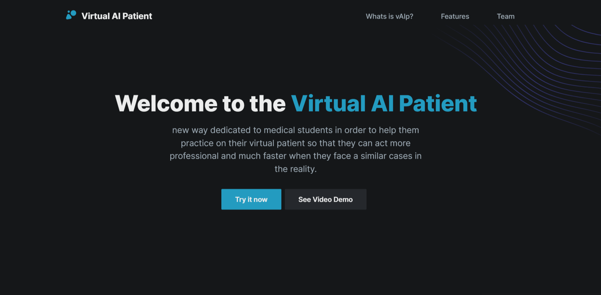
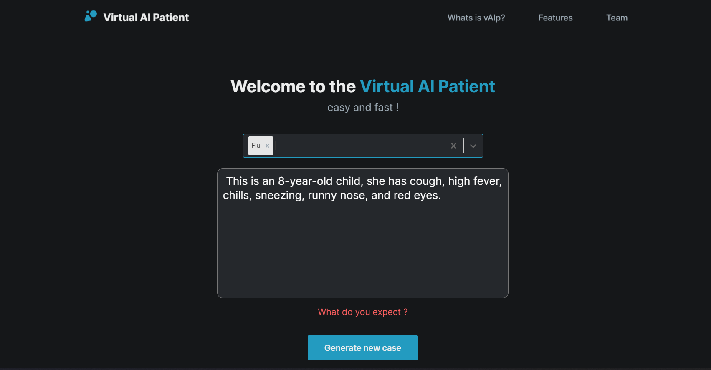

# <h1>  Virtual AI Patient</h1>
"Virtual AI Patient" is a new way dedicated to medical students in order to help them practice on their virtual patient so that they can act more professional and much faster when they face a similar cases in  the reality.

### Preview
 
 

### Try in now
you can take a look at our official website:
https://virtual-ai-patient.ammari.live

